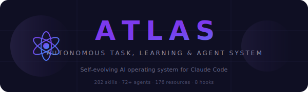

<p align="center">
  <picture>
    <source media="(prefers-color-scheme: dark)" srcset="assets/atlas-banner-dark.svg">
    <source media="(prefers-color-scheme: light)" srcset="assets/atlas-banner-light.svg">
    
  </picture>
</p>

<h3 align="center"><b>A</b>utonomous <b>T</b>ask, <b>L</b>earning, and <b>A</b>gent <b>S</b>ystem</h3>

<p align="center">
  A self-evolving AI operating system for Claude Code<br>
  <sub>It doesn't just follow instructions — it learns, adapts, and grows itself.</sub>
</p>

<p align="center">
  <a href="#-what-is-atlas">What</a> &bull;
  <a href="#quick-start">Install</a> &bull;
  <a href="#the-entry-points">Commands</a> &bull;
  <a href="#autonomous-behaviors">Behaviors</a> &bull;
  <a href="#the-flow-system">Flow</a> &bull;
  <a href="#hook-lifecycle">Hooks</a> &bull;
  <a href="#architecture">Architecture</a>
</p>

<p align="center">
  
  
  
  
  
  
  
</p>

---

## What is ATLAS?

Most Claude Code setups are a `CLAUDE.md` with some rules. ATLAS is a **full infrastructure layer** — 14 lifecycle hooks, 74 specialized agents, a persistent knowledge graph, an in-session action graph, and self-evolving skill/memory systems that let Claude Code grow its own capabilities.

<table>
<tr>
<td width="50%">

**What you type:**
```
build a REST API for user management
```

**What ATLAS does:**
1. Scores complexity → **TEAM** (score: 9)
2. Spawns 3 agents: architect, implementer, tester
3. Routes to Tier 3 (Sonnet) for cost efficiency
4. Loads relevant skills (FastAPI, security, testing)
5. Executes with parallel agents in isolated worktrees
6. Security scans before marking done
7. Learns from any mistakes for next time

</td>
<td width="50%">

```
       ┌──────────────────────────────────┐
       │            A T L A S             │
       ├──────────────────────────────────┤
       │                                  │
       │  /new  /resume  /task  /done     │ ← You
       │         │                        │
       │         ▼                        │
       │  ┌───────────┐  ┌───────────┐    │
       │  │   Flow    │  │   Smart   │    │ ← Routing
       │  │  System   │  │   Swarm   │    │
       │  └─────┬─────┘  └─────┬─────┘    │
       │        ▼              ▼          │
       │  ┌──────────────────────────┐    │
       │  │ 66 Skills · 74 Agents    │    │ ← Execution
       │  │ 14 Hooks  · 3 Rule Files │    │
       │  └──────────┬───────────────┘    │
       │             ▼                    │
       │  ┌──────────────────────────┐    │
       │  │ Learn · Evolve · Grow    │    │ ← Growth
       │  └──────────────────────────┘    │
       └──────────────────────────────────┘
```

</td>
</tr>
</table>

> **TL;DR** — It continues its own work when context runs out. It deploys agent teams based on task complexity. It creates new skills when it finds capability gaps. It learns from mistakes across sessions.

---

## Quick Start

```bash
# Clone
git clone https://github.com/Leo-Atienza/atlas-claude.git

# Install (safe — never overwrites existing files)
cd atlas-claude && bash install.sh

# Verify system health
bash ~/.claude/scripts/smoke-test.sh
```

See [`examples/`](examples/) for a starter `settings.json` template with sensible defaults.

---

## The Entry Points

Everything funnels through a small set of entry commands. You never need to think about the 66 active skills, 74 agents, or 43 commands underneath.

| Command | Plain English | What Happens Under the Hood |
|:-------:|:-------------|:---------------------------|
| `/new` | "build X", "create X" | Classifies task → auto-detects depth → initializes Flow → routes to agents |
| `/resume` | "continue", "pick up" | Reads handoff + state files in precedence order → restores full context → continues |
| `/task` | "fix X", "add X" | One-off routing → complexity scoring → direct execution |
| `/done` | "wrap up" | Reflects → captures knowledge → saves state → commits |
| `/ship` | "push this" | Commits → pushes → opens PR → security scan |
| `/dream` | "consolidate" | Deep memory merge → prune stale → resolve conflicts → reindex |
| `/handoff` | "end session" | Build + test → commit → push → chat handoff block |
| `/audit` | "check this repo" | Wave-based systematic audit with verified fixes |
| `/health` | "system status" | Validates hooks, counts, drift; updates SYSTEM_VERSION |

---

## Autonomous Behaviors

These happen **without user action**. ATLAS monitors, decides, and acts.

### Auto-Continuation

When context nears limits, ATLAS writes a structured handoff so a new session can pick up exactly where it left off. Handoffs live per-CWD at `~/.claude/handoffs/<cwd-slug>.md`.

### Smart Swarm

Every task is scored across multiple dimensions on a 0-15 scale:

```
 File Scope ──┐
 Concerns ────┤
 Risk ────────┼── Score ──→ SOLO (0-4)  │ DUO (5-7)  │ TEAM (8-11) │ SWARM (12-15)
 Isolation ───┤            execute      2 agents      3-4 agents    wave execution
 Urgency ─────┘            directly     in parallel   + coordinator  + worktrees
```

Combined with **three-tier model routing** — Haiku for simple subtasks, Sonnet for implementation, Opus for architecture — to cut token costs without sacrificing quality.

### Atlas Intelligence Layer

Three persistence systems with strict boundaries:

```
Memory  (projects/*/memory/)   user profile, feedback, project context, external refs
Knowledge Store  (topics/)     G-PAT, G-SOL, G-ERR, G-PREF, G-FAIL — reusable patterns
Atlas KG  (atlas-kg/)          facts NOT derivable from git/code — architectural truths
```

Plus an in-session **action graph** (`atlas-action-graph/`) that tracks reads/searches, feeds a duplicate-read advisory, and surfaces a hot-set digest across PreCompact and SessionStart.

### Defense-in-Depth Security

```
Layer 1 (PreToolUse):  context-guard.js — secrets, context budget, duplicate-read advisory
Layer 2 (PreToolUse):  cctools safety hooks — bash command patterns, file length, env reads, rm-block
Layer 3 (PreToolUse):  pre-commit-gate.js — warns if build+test wasn't run before commit
Layer 4 (PostToolUse): tsc-check.js + post-tool-monitor.js — type errors + failure/efficiency telemetry
Layer 5 (PostToolUseFailure): tool-failure-handler.js — circuit breaker, MCP classification
```

### Code Graph Integration (CRG)

When a project has `.code-review-graph/graph.db`, ATLAS prefers the CRG MCP tools (`get_minimal_context`, `query_graph`, `get_impact_radius`, `semantic_search_nodes`) over Glob/Grep. The graph auto-updates on every Write/Edit via a PostToolUse hook. Falls back to graphify (`graphify-out/graph.json`) for mixed-corpus projects.

---

## The Flow System

One unified workflow system with 21 Flow commands:

```
Trivial ─────→ Quick ─────→ Standard ─────→ Deep ─────→ Epic
(<20 lines)    (small)      (3-10 files)    (10-30)     (system-wide)
    │             │              │              │             │
    ▼             ▼              ▼              ▼             ▼
 Just do      Minimal       Plan →         Full plan     Wave-based
   it         ceremony      Execute       + parallel      + swarm
                                           agents         mode
```

**Flow commands**: `/flow:start`, `/flow:plan`, `/flow:go`, `/flow:quick`, `/flow:map`, `/flow:review`, `/flow:verify`, `/flow:ship`, `/flow:debug`, `/flow:discover`, `/flow:brainstorm`, `/flow:ground`, `/flow:compound`, `/flow:complete`, `/flow:retro`, `/flow:status`, `/flow:test`, `/flow:smart-swarm`, `/flow:swarm`, `/flow:team`, `/flow:auto`.

**Flow agents**: planner, executor, verifier, mapper, debugger, UAT, external-researcher, repo-analyst, learnings-researcher, research-synthesizer, git-analyst, compound-writer, risk-assessor, plan-checker, security-auditor, and the smart-swarm-coordinator.

---

## Hook Lifecycle

14 hooks across 8 lifecycle events create a fully reactive system:

```
┌─ SessionStart ──────────────────────────────────────────────────┐
│  session-start.sh      Handoff, version, rotation, KG, action-   │
│                        graph carryover (48h guard)               │
├─ UserPromptSubmit ──────────────────────────────────────────────┤
│  allow_git_hook.py     Session-scoped git approval               │
├─ PreToolUse ────────────────────────────────────────────────────┤
│  context-guard.js      Duplicate-read advisory + security gate   │
│                        + context budget                          │
│  bash_hook.py          Dangerous shell command blocker           │
│  rm_block_hook.py      Enforce "mv to TRASH" over rm             │
│  file_length_limit     Prevent file bloat                        │
│  read_env_protection   Protect env file reads                    │
│  pre-commit-gate.js    Warn if build+test not run before commit  │
│  graph-hint (bash)     Suggest CRG/graphify MCP over Glob/Grep   │
├─ PostToolUse ───────────────────────────────────────────────────┤
│  auto-formatter        prettier / dart format on save            │
│  tsc-check.js          TS errors injected as additionalContext   │
│  CRG auto-update       Incremental graph update on Write/Edit    │
│  post-tool-monitor.js  Context, efficiency, failure telemetry    │
│                        + action-graph retrieval logging          │
├─ PostToolUseFailure ────────────────────────────────────────────┤
│  tool-failure-handler  Circuit breaker, tool health, MCP tag     │
├─ PreCompact ────────────────────────────────────────────────────┤
│  precompact-reflect.sh KG preservation + action-graph hot-set    │
│                        digest injection (Tier 2)                 │
├─ Stop ──────────────────────────────────────────────────────────┤
│  session-stop.sh       Handoff, todos, KG capture, stats rollup  │
├─ Notification ──────────────────────────────────────────────────┤
│  claudio               Desktop notifications                     │
└─────────────────────────────────────────────────────────────────┘
```

Additional safety hooks ship on disk but are **opt-in** (not registered by default): `git_add_block_hook`, `git_checkout_safety_hook`, `git_commit_block_hook`, `env_file_protection_hook`. See [`hooks/README.md`](hooks/README.md#opt-in-safety-hooks-unregistered-by-default) for activation.

---

## Skill Domains

Active skills are indexed in `skills/ACTIVE-DIRECTORY.md` across three pages:

<table>
<tr><th>Page</th><th>Count</th><th>Highlights</th></tr>
<tr><td><b>Web &amp; Frontend</b> (Page 1)</td><td>34</td><td>React, Next.js, animation, design systems, web testing, security</td></tr>
<tr><td><b>Backend &amp; Tools</b> (Page 2)</td><td>22</td><td>FastAPI, Express, deployment, workflow, MCP tooling</td></tr>
<tr><td><b>Native &amp; Cross-Platform</b> (Page 3)</td><td>10</td><td>Expo, Tauri, SwiftUI, Jetpack Compose, Maestro</td></tr>
</table>

Archived skills live under `skills/ARCHIVE-DIRECTORY.md` (7 domain bundles). Third-party skill packs on disk include `trailofbits-security`, `fullstack-dev`, `context-engineering-kit`, `compound-engineering`, and `cctools`.

---

## Architecture

```
~/.claude/
├── CLAUDE.md                    # Slim core instructions (~8KB)
├── ARCHITECTURE.md              # System architecture reference
├── REFERENCE.md                 # Slash commands, MCP patterns, generators
├── SYSTEM_VERSION.md            # Component inventory + health (auto-updated)
├── SYSTEM_CHANGELOG.md          # Infrastructure version history
├── settings.json                # Hook wiring, permissions, env vars
│
├── hooks/                       # 14 lifecycle hooks
│   ├── lib.js                   #   Shared utilities (all Node hooks import this)
│   ├── context-guard.js         #   PreToolUse — duplicate-read + security gate
│   ├── post-tool-monitor.js     #   PostToolUse — telemetry + action-graph logging
│   ├── tool-failure-handler.js  #   PostToolUseFailure — circuit breaker
│   ├── pre-commit-gate.js       #   PreToolUse — build+test reminder
│   ├── tsc-check.js             #   PostToolUse — TypeScript diagnostics
│   ├── atlas-kg.js              #   Temporal knowledge graph module
│   ├── atlas-extractor.js       #   Regex classifier (text → G-PAT/G-SOL/...)
│   ├── atlas-action-graph.js    #   In-session retrieval log + priority queue
│   ├── session-start.sh         #   SessionStart — handoff + KG + carryover
│   ├── session-stop.sh          #   Stop — handoff + KG capture + stats rollup
│   ├── statusline.js            #   StatusLine — context bar, task, call count
│   └── cctools-safety-hooks/    #   Python safety blockers (bash, rm, env, file len)
│
├── skills/                      # 66 active skills (105 on disk)
│   ├── ACTIVE-DIRECTORY.md      #   Index of active skills
│   ├── ACTIVE-PAGE-1-*.md       #   Web + frontend skills (34)
│   ├── ACTIVE-PAGE-2-*.md       #   Backend + tools skills (22)
│   ├── ACTIVE-PAGE-3-*.md       #   Native + cross-platform skills (10)
│   ├── ARCHIVE-DIRECTORY.md     #   Archived skills by domain bundle
│   ├── RULES-GIT.md             #   On-demand git workflow rules
│   ├── RULES-SECURITY.md        #   On-demand security rules + triggers
│   ├── RULES-TESTING.md         #   On-demand testing rules
│   └── [domain]/SKILL.md        #   Individual skill definitions
│
├── topics/                      # Knowledge store (72 entries)
│   ├── KNOWLEDGE-DIRECTORY.md   #   Index
│   ├── KNOWLEDGE-PAGE-1-patterns.md    #   G-PAT (29)
│   ├── KNOWLEDGE-PAGE-2-solutions.md   #   G-SOL (17)
│   ├── KNOWLEDGE-PAGE-3-errors.md      #   G-ERR (12)
│   ├── KNOWLEDGE-PAGE-4-preferences.md #   G-PREF (8)
│   └── KNOWLEDGE-PAGE-5-failures.md    #   G-FAIL (6)
│
├── commands/                    # 43 slash commands
│   ├── new.md, resume.md, ...   #   Top-level entry points
│   └── flow/*.md                #   21 Flow workflow commands
│
├── agents/                      # 74 specialized agents
│   ├── flow-*.md                #   Flow agents (planner, executor, verifier, ...)
│   ├── smart-swarm-coordinator  #   Multi-agent orchestrator
│   └── [domain]/*.md            #   Domain specialists
│
├── atlas-kg/                    # Persistent knowledge graph (cross-session)
│   ├── entities.json            #   Entities with validity windows
│   └── triples.json             #   Subject-predicate-object triples
│
├── atlas-action-graph/          # In-session retrieval log + priority queue
│   ├── ${session_id}.jsonl      #   Append-only event log
│   ├── ${session_id}.state.json #   Priority queue (atomic writes)
│   └── snapshots/               #   PreCompact state-file snapshots
│
├── scripts/                     # System utilities
│   ├── smoke-test.sh            #   System validator
│   ├── health-validator.js      #   Drift + health verification
│   ├── health-dashboard.js      #   Metrics surface
│   └── progressive-learning/    #   PreCompact reflection scripts
│
└── projects/*/memory/           # Per-CWD auto-memory (user/feedback/project/reference)
```

## State Management

When resuming, ATLAS reads state in strict precedence order:

| Priority | Source | Purpose |
|:--------:|:-------|:--------|
| 1 | `.flow/state.yaml` | Active Flow workflow state (authoritative) |
| 2 | `~/.claude/handoffs/<cwd-slug>.md` | Git state + todos from Stop hook (per-CWD — slug replaces `/`, `\`, `:` with `_`) |
| 3 | `~/.claude/atlas-action-graph/${session_id}.state.json` | Previous session's hot-set (48h carryover guard) |
| 4 | `~/.claude/atlas-kg/{entities,triples}.json` | Long-term architectural facts |

---

## MCP Servers

Two registries:

- **`~/.claude.json`** (top-level `mcpServers`) — **USER scope**, global across all CWDs. Managed via `claude mcp add|remove -s user`.
- **`~/.claude/.mcp.json`** — **PROJECT scope**, loaded only when CWD is `~/.claude/`.

Currently ✓ Connected at user scope: `code-review-graph`, `magicuidesign-mcp`, `shadcn`, `prisma`, `tauri-mcp`, `lighthouse`, `heroui`, `context-mode`, `mobile`, `aceternity`, `iconify`, `plugin:firebase:firebase`, and more. Project-scope entries load from `.mcp.json` when CWD=`~/.claude/` and promote to user scope via the `_activate` commands documented in that file.

OAuth-pending (sign-in on first use): `cloudflare`, `linear`, `expo`, `posthog`, `vercel`, `statsig`, `plugin:asana:asana`, `plugin:figma:figma`.

See [`ARCHITECTURE.md`](ARCHITECTURE.md#mcp-servers) for the complete list.

---

## Optional Components

Some hooks reference external components. They degrade gracefully — silent no-op if missing:

| Component | Purpose | How to Get |
|-----------|---------|-----------|
| `cctools-safety-hooks/` | Block dangerous bash commands, file limits, rm enforcement | Install [cctools](https://github.com/anthropics/claude-code-community-tools) |
| `progressive-learning/` | Force reflection before compaction | Ships with ATLAS |
| `claudio` | Audio notifications | Optional binary at `~/.claude/bin/claudio` |
| `code-review-graph` | Tree-sitter code graph (23 languages) | `uvx code-review-graph build` per project |
| `graphify` | Mixed-corpus graph (docs + code + images) | `python -m graphify .` per folder |

---

## What's Novel

| Feature | What It Does | Why It Matters |
|---------|-------------|----------------|
| **Auto-continuation** | Context-aware session chaining with structured handoff | Never lose work mid-task |
| **Complexity scoring** | Automatic agent team deployment | Right-sized execution without asking |
| **Self-evolution** | Creates skills + adds MCP servers on capability gaps | System grows with your needs |
| **Three-layer persistence** | Memory (user) + Knowledge Store (patterns) + Atlas KG (facts) | Strict boundaries, no overlap |
| **Action graph** | In-session retrieval log with priority queue + hot-set carryover | Duplicate-read advisory + PreCompact digest survival |
| **Tier routing** | Haiku/Sonnet/Opus per subtask | Token cost reduction without quality loss |
| **Circuit breaker** | Failure tracking + MCP-aware classification | Prevents runaway tool failures |
| **CRG integration** | Tree-sitter code graph with MCP tool preference | Minimal-context navigation over Glob/Grep |

---

## System Validation

```bash
# Full system smoke test
bash ~/.claude/scripts/smoke-test.sh

# Health dashboard
node ~/.claude/scripts/health-dashboard.js

# Slash command (updates SYSTEM_VERSION.md)
/health
```

---

## License

MIT License. Use it, modify it, make it yours.

## Author

**Leo Atienza**

<p align="center">
  <sub>Built with Claude Code (Opus 4.7) and an unhealthy amount of ambition.</sub>
</p>
