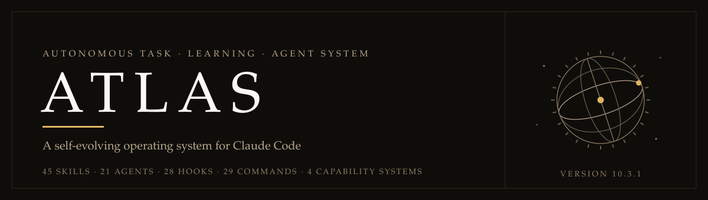

<p align="center">
  <picture>
    <source media="(prefers-color-scheme: dark)" srcset="assets/atlas-banner-dark.svg">
    <source media="(prefers-color-scheme: light)" srcset="assets/atlas-banner-light.svg">
    
  </picture>
</p>

<h3 align="center"><b>A</b>utonomous <b>T</b>ask, <b>L</b>earning, and <b>A</b>gent <b>S</b>ystem</h3>

<p align="center">
  A self-evolving AI operating system for Claude Code<br>
  <sub>It doesn't just follow instructions — it learns, adapts, and grows itself.</sub>
</p>

<p align="center">
  <a href="#-what-is-atlas">What</a> &bull;
  <a href="#quick-start">Install</a> &bull;
  <a href="#the-entry-points">Commands</a> &bull;
  <a href="#autonomous-behaviors">Behaviors</a> &bull;
  <a href="#workflow-depth-v10">Workflow</a> &bull;
  <a href="#hook-lifecycle">Hooks</a> &bull;
  <a href="#architecture">Architecture</a>
</p>

<p align="center">
  <!-- Badge counts are illustrative; authoritative live counts are in SYSTEM_VERSION.md / cache/system-ground-truth.json -->
  
  
  
  
  
  
  
</p>

---

## What is ATLAS?

Most Claude Code setups are a `CLAUDE.md` with some rules. ATLAS is a **full infrastructure layer** — lifecycle hooks, a registered agent roster (`agents/AGENTS.md`), a persistent knowledge graph, an in-session action graph, and self-evolving skill/memory systems that let Claude Code grow its own capabilities. Since v7.0, drift catches itself: telemetry feeds an `/observe` dashboard and a session-start drift-proposer; since v10, an evidence-fused usage ledger (`scripts/usage-report.js`) drives a weekly inventory loop so nothing unused accumulates.

<table>
<tr>
<td width="50%">

**What you type:**
```
build a REST API for user management
```

**What ATLAS does:**
1. Recalls prior work first (`/recall` fused retrieval — don't re-derive)
2. Loads the matching skills + Capability System for the stack
3. Plans at the right depth (brief plan → plan file for multi-phase work)
4. Executes wave-by-wave with verification between waves
5. For known fan-out structure: the Workflow tool; for high-stakes calls: the council (two orchestration lanes)
6. Security scans before marking done
7. Learns from any mistakes for next time

</td>
<td width="50%">

```
       ┌──────────────────────────────────┐
       │            A T L A S             │
       ├──────────────────────────────────┤
       │                                  │
       │  /new  /resume  /task  /done     │ ← You
       │         │                        │
       │         ▼                        │
       │  ┌───────────┐  ┌───────────┐    │
       │  │ Workflow  │  │  Council  │    │ ← Two lanes
       │  │  (fan-out)│  │ (judgment)│    │
       │  └─────┬─────┘  └─────┬─────┘    │
       │        ▼              ▼          │
       │  ┌──────────────────────────┐    │
       │  │ 53 Skills · 21 Agents    │    │ ← Execution
       │  │ 28 Hooks  · 5 Rule Files │    │
       │  └──────────┬───────────────┘    │
       │             ▼                    │
       │  ┌──────────────────────────┐    │
       │  │ Learn · Evolve · Grow    │    │ ← Growth
       │  └──────────────────────────┘    │
       └──────────────────────────────────┘
```

</td>
</tr>
</table>

> **TL;DR** — It continues its own work when context runs out. It deploys agent teams based on task complexity. It creates new skills when it finds capability gaps. It learns from mistakes across sessions.

---

## Quick Start

```bash
# Clone
git clone https://github.com/Leo-Atienza/atlas-claude.git

# Install (safe — never overwrites existing files)
cd atlas-claude && bash install.sh

# Verify system health
bash ~/.claude/scripts/smoke-test.sh
```

See [`examples/`](examples/) for a starter `settings.json` template with sensible defaults.

---

## The Entry Points

Everything funnels through a small set of entry commands. You never need to think about the 53 active skills or 36 commands underneath — nor the registered agent roster (`agents/AGENTS.md`).

| Command | Plain English | What Happens Under the Hood |
|:-------:|:-------------|:---------------------------|
| `/new` | "build X", "create X" | Classifies task → plans at the right depth → executes (Workflow lane for known fan-out) |
| `/resume` | "continue", "pick up" | Reads handoff + state files in precedence order → restores full context → continues |
| `/task` | "fix X", "add X" | One-off routing → complexity scoring → direct execution |
| `/done` | "wrap up" | Reflects → captures knowledge → saves state → commits |
| `/ship` | "push this" | Commits → pushes → opens PR → security scan |
| `/handoff` | "end session" | Build + test → commit → push → chat handoff block |
| `/review-proposals` | "what's Claude proposing?" | Reviews the A4 queue — the only self-modification path (conductor files here weekly) |
| `/health` | "system status" | Validates hooks, counts, drift; updates SYSTEM_VERSION |
| `/observe` | "how's the system?" | 6-section dashboard (tool health, safety hooks, skills, tasks, action graph, cleanup) |
| `/apply-drift-fix` | "fix the drift" | Reads last drift proposal, routes to archive/disable/retrigger action |

---

## Autonomous Behaviors

These happen **without user action**. ATLAS monitors, decides, and acts.

### Auto-Continuation

When context nears limits, ATLAS writes a structured handoff so a new session can pick up exactly where it left off. Handoffs live per-CWD at `~/.claude/handoffs/<cwd-slug>.md`.

### Orchestration — two lanes (v10)

Multi-agent work routes through exactly two mechanisms (the former smart-swarm scoring system is archived — `skills/_archived/smart-swarm/`):

```
 Known structure (fan-out, judge panels, ──→  Workflow tool   (deterministic pipelines,
 migrations, adversarial verify)               user-opted-in: "use a workflow")

 High-stakes judgment (architecture, ─────→  Council          (2-4 subagents with diverse
 security, hard-to-reverse choices)            lenses, or agent-teams for real debate)
```

Routine tasks stay single-pass — orchestration cost isn't free.

### Atlas Intelligence Layer

Two persistence systems with strict boundaries (collapsed from 3 → 2 in v8.0.0 — Memory + Knowledge Store merged into the Obsidian vault):

```
Vault  (<your-vault-path>/wiki/)  personal/ (profile, feedback, project context) + engineering/ (KNOWLEDGE-NNN: pattern|solution|error|preference|failure). Local-only git.
Atlas KG  (atlas-kg/)            facts NOT derivable from git/code — architectural truths
```

Plus an in-session **action graph** (`atlas-action-graph/`) that tracks reads/searches, feeds a duplicate-read advisory, and surfaces a hot-set digest across PreCompact and SessionStart.

### Defense-in-Depth Security

```
Layer 1 (PreToolUse):  context-guard.js — secrets, context budget, duplicate-read advisory
Layer 2 (PreToolUse):  cctools safety hooks — bash command patterns, file length, env reads, rm-block
Layer 3 (PreToolUse):  pre-commit-gate.js — warns if build+test wasn't run before commit
Layer 4 (PostToolUse): tsc-check.js + post-tool-monitor.js — type errors + failure/efficiency telemetry
Layer 5 (PostToolUseFailure): tool-failure-handler.js — circuit breaker, MCP classification
```

### Code Graph Integration (CRG)

When a project has `.code-review-graph/graph.db`, ATLAS prefers the CRG MCP tools (`get_minimal_context`, `query_graph`, `get_impact_radius`, `semantic_search_nodes`) over Glob/Grep. The graph auto-updates on every Write/Edit via a PostToolUse hook. Falls back to graphify (`graphify-out/graph.json`) for mixed-corpus projects.

---

## Workflow depth (v10)

Task depth scales without a dedicated command family (the former Flow system — 19 commands + 15 agents, zero recorded uses — is archived as one bundle at `skills/_archived/flow/`; a repo containing `.flow/state.yaml` auto-offers its restore):

```
Trivial ─────→ Small ──────→ Medium ────────→ Large / multi-phase
(<20 lines)    (1-3 files)   (3-10 files)     (10+ files)
    │             │              │                  │
    ▼             ▼              ▼                  ▼
 Just do      Brief plan     Present plan,     Plan file in plans/ →
   it         first          get approval      execute wave-by-wave,
                                               validators between waves
```

---

## Hook Lifecycle

Hooks across 9 lifecycle events create a fully reactive system (current count in the components box above — sync-counts-anchored):

```
┌─ SessionStart ──────────────────────────────────────────────────┐
│  session-start.sh      Handoff, version, rotation, KG, action-   │
│                        graph carryover (48h guard)               │
│  cleanup-runner.js     25 declarative cleanup rules (v7.0)       │
│  drift-proposer.js     At most ONE DRIFT advisory per session    │
├─ UserPromptSubmit ──────────────────────────────────────────────┤
│  allow_git_hook.py     Session-scoped git approval               │
├─ PreToolUse ────────────────────────────────────────────────────┤
│  context-guard.js      Duplicate-read advisory + security gate   │
│                        + context budget                          │
│  bash_hook.py          Dangerous shell command blocker           │
│  rm_block_hook.py      Enforce "mv to TRASH" over rm             │
│  file_length_limit     Prevent file bloat                        │
│  read_env_protection   Protect env file reads                    │
│  pre-commit-gate.js    Warn if build+test not run before commit  │
│  graph-hint (bash)     Suggest CRG/graphify MCP over Glob/Grep   │
│  skill-usage-log.js    Append {ts, skill, cwd} on Skill (v7.0)   │
├─ PostToolUse ───────────────────────────────────────────────────┤
│  auto-formatter        prettier / dart format on save            │
│  tsc-check.js          TS errors injected as additionalContext   │
│  CRG auto-update       Incremental graph update on Write/Edit    │
│  post-tool-monitor.js  Context, efficiency, failure telemetry    │
│                        + action-graph retrieval logging          │
├─ PostToolUseFailure ────────────────────────────────────────────┤
│  tool-failure-handler  Circuit breaker, tool health, MCP tag     │
├─ PreCompact ────────────────────────────────────────────────────┤
│  precompact-reflect.sh KG preservation + action-graph hot-set    │
│                        digest injection (Tier 2)                 │
├─ Stop ──────────────────────────────────────────────────────────┤
│  session-stop.sh       Handoff, todos, KG capture, stats rollup  │
├─ Notification ──────────────────────────────────────────────────┤
│  claudio               Desktop notifications                     │
├─ StatusLine ────────────────────────────────────────────────────┤
│  statusline.js         Context bar, task, call count             │
└─────────────────────────────────────────────────────────────────┘
```

Additional safety hooks ship on disk but are **opt-in** (not registered by default): `git_add_block_hook`, `git_checkout_safety_hook`, `git_commit_block_hook`, `env_file_protection_hook`. See [`hooks/README.md`](hooks/README.md#opt-in-safety-hooks-unregistered-by-default) for activation.

---

## Skill Domains

Active skills are indexed in `skills/ACTIVE-DIRECTORY.md` across three pages:

<table>
<tr><th>Page</th><th>Count</th><th>Highlights</th></tr>
<tr><td><b>Web &amp; Frontend</b> (Page 1)</td><td>34</td><td>React, Next.js, animation, design systems, web testing, security</td></tr>
<tr><td><b>Backend &amp; Tools</b> (Page 2)</td><td>22</td><td>FastAPI, Express, deployment, workflow, MCP tooling</td></tr>
<tr><td><b>Native &amp; Cross-Platform</b> (Page 3)</td><td>10</td><td>Expo, Tauri, SwiftUI, Jetpack Compose, Maestro</td></tr>
</table>

Archived skills live under `skills/ARCHIVE-DIRECTORY.md` (7 domain bundles). Third-party skill packs on disk include `trailofbits-security`, `fullstack-dev`, `context-engineering-kit`, `compound-engineering`, and `cctools`.

---

## Architecture

```
~/.claude/
├── CLAUDE.md                    # Slim core instructions (~8KB)
├── ARCHITECTURE.md              # System architecture reference
├── REFERENCE.md                 # Slash commands, MCP patterns, generators
├── SYSTEM_VERSION.md            # Component inventory + health (auto-updated)
├── SYSTEM_CHANGELOG.md          # Infrastructure version history
├── settings.json                # Hook wiring, permissions, env vars
│
├── hooks/                       # 24 lifecycle hooks (30+ files incl. helpers)
│   ├── lib.js                   #   Shared utilities (all Node hooks import this)
│   ├── context-guard.js         #   PreToolUse — duplicate-read + security gate
│   ├── post-tool-monitor.js     #   PostToolUse — telemetry + action-graph logging
│   ├── tool-failure-handler.js  #   PostToolUseFailure — circuit breaker
│   ├── pre-commit-gate.js       #   PreToolUse — build+test reminder
│   ├── tsc-check.js             #   PostToolUse — TypeScript diagnostics
│   ├── skill-usage-log.js       #   PreToolUse Skill — usage telemetry (v7.0)
│   ├── cleanup-runner.js        #   SessionStart — 25 declarative cleanup rules
│   ├── cleanup-config.json      #     Cleanup engine rules (per-mode)
│   ├── drift-proposer.js        #   SessionStart — DRIFT advisor (v7.0)
│   ├── drift-thresholds.json    #     Per-channel cooldowns + silenced-kinds
│   ├── atlas-kg.js              #   Temporal knowledge graph module
│   ├── atlas-extractor.js       #   Regex classifier (text → KNOWLEDGE-NNN with type:)
│   ├── atlas-action-graph.js    #   In-session retrieval log + priority queue
│   ├── session-start.sh         #   SessionStart — handoff + KG + carryover
│   ├── session-stop.sh          #   Stop — handoff + KG capture + stats rollup
│   ├── statusline.js            #   StatusLine — context bar, task, call count
│   └── cctools-safety-hooks/    #   Python safety blockers (bash, rm, env, file len)
│
├── skills/                      # 53 active skill entries (see SYSTEM_VERSION.md; 45 dirs in _archived/)
│   ├── ACTIVE-DIRECTORY.md      #   Index of active skills
│   ├── ACTIVE-PAGE-1-*.md       #   Web + frontend skills (22)
│   ├── ACTIVE-PAGE-2-*.md       #   Backend + tools skills (13)
│   ├── ACTIVE-PAGE-3-*.md       #   Native + cross-platform skills (9)
│   ├── ARCHIVE-DIRECTORY.md     #   Archived skills by domain bundle
│   ├── RULES-GIT.md             #   On-demand git workflow rules
│   ├── RULES-SECURITY.md        #   On-demand security rules + triggers
│   ├── RULES-TESTING.md         #   On-demand testing rules
│   └── [domain]/SKILL.md        #   Individual skill definitions
│
│   # Knowledge store retired in v8.0.0 — migrated to the Obsidian vault at
│   #   <your-vault-path>/wiki/engineering/ (146 entries across patterns/solutions/errors/preferences/failures)
│
├── commands/                    # slash commands (count in the components box — sync-counts-anchored)
│   └── new.md, resume.md, ...   #   Top-level entry points (incl. v7.0 /observe + /apply-drift-fix)
│
├── agents/                      # 16 custom agents (74 incl. plugin packs)
│   ├── flow-*.md                #   Flow agents (planner, executor, verifier, ...)
│   ├── smart-swarm-coordinator  #   Multi-agent orchestrator
│   └── [domain]/*.md            #   Domain specialists
│
├── atlas-kg/                    # Persistent knowledge graph (cross-session)
│   ├── entities.json            #   Entities with validity windows
│   └── triples.json             #   Subject-predicate-object triples
│
├── atlas-action-graph/          # In-session retrieval log + priority queue
│   ├── ${session_id}.jsonl      #   Append-only event log
│   ├── ${session_id}.state.json #   Priority queue (atomic writes)
│   └── snapshots/               #   PreCompact state-file snapshots
│
├── scripts/                     # System utilities
│   ├── smoke-test.sh            #   System validator
│   ├── health-validator.js      #   Drift + health verification
│   ├── system-doctor.js         #   Unified validator scoreboard (/system-doctor)
│   ├── observability.js         #   Telemetry dashboard (/observe)
│   └── progressive-learning/    #   PreCompact reflection scripts
│
└── projects/<cwd>/              # Per-CWD Claude Code session transcripts + logs (auto-memory subsystem retired v8.0.0)
```

## State Management

When resuming, ATLAS reads state in strict precedence order:

| Priority | Source | Purpose |
|:--------:|:-------|:--------|
| 1 | `.flow/state.yaml` | Active Flow workflow state (authoritative) |
| 2 | `~/.claude/handoffs/<cwd-slug>.md` | Git state + todos from Stop hook (per-CWD — slug replaces `/`, `\`, `:` with `_`) |
| 3 | `~/.claude/atlas-action-graph/${session_id}.state.json` | Previous session's hot-set (48h carryover guard) |
| 4 | `~/.claude/atlas-kg/{entities,triples}.json` | Long-term architectural facts |

---

## MCP Servers

Two registries:

- **`~/.claude.json`** (top-level `mcpServers`) — **USER scope**, global across all CWDs. Managed via `claude mcp add|remove -s user`.
- **`~/.claude/.mcp.json`** — **PROJECT scope**, loaded only when CWD is `~/.claude/`.

Currently ✓ Connected at user scope: `code-review-graph`, `magicuidesign-mcp`, `shadcn`, `prisma`, `tauri-mcp`, `lighthouse`, `heroui`, `context-mode`, `mobile`, `aceternity`, `iconify`, `plugin:firebase:firebase`, and more. Project-scope entries load from `.mcp.json` when CWD=`~/.claude/` and promote to user scope via the `_activate` commands documented in that file.

OAuth-pending (sign-in on first use): `cloudflare`, `linear`, `expo`, `posthog`, `vercel`, `statsig`, `plugin:asana:asana`, `plugin:figma:figma`.

See [`ARCHITECTURE.md`](ARCHITECTURE.md#mcp-servers) for the complete list.

---

## Optional Components

Some hooks reference external components. They degrade gracefully — silent no-op if missing:

| Component | Purpose | How to Get |
|-----------|---------|-----------|
| `cctools-safety-hooks/` | Block dangerous bash commands, file limits, rm enforcement | Install [cctools](https://github.com/anthropics/claude-code-community-tools) |
| `progressive-learning/` | Force reflection before compaction | Ships with ATLAS |
| `claudio` | Audio notifications | Optional binary at `~/.claude/bin/claudio` |
| `code-review-graph` | Tree-sitter code graph (23 languages) | `uvx code-review-graph build` per project |
| `graphify` | Mixed-corpus graph (docs + code + images) | `python -m graphify .` per folder |

---

## What's Novel

| Feature | What It Does | Why It Matters |
|---------|-------------|----------------|
| **Auto-continuation** | Context-aware session chaining with structured handoff | Never lose work mid-task |
| **Complexity scoring** | Automatic agent team deployment | Right-sized execution without asking |
| **Self-evolution** | Creates skills + adds MCP servers on capability gaps | System grows with your needs |
| **Two-layer persistence** | Vault (personal + engineering knowledge, v8.0.0 merge) + Atlas KG (facts) | Strict boundaries, no overlap |
| **Action graph** | In-session retrieval log with priority queue + hot-set carryover | Duplicate-read advisory + PreCompact digest survival |
| **Tier routing** | Haiku/Sonnet/Opus per subtask | Token cost reduction without quality loss |
| **Circuit breaker** | Failure tracking + MCP-aware classification | Prevents runaway tool failures |
| **CRG integration** | Tree-sitter code graph with MCP tool preference | Minimal-context navigation over Glob/Grep |
| **Observability dashboard** (v7.0) | `/observe` renders telemetry from 6 streams | The system shows you what's drifting before you ask |
| **Drift proposer** (v7.0) | SessionStart emits at most 1 advisory per session | Self-surfacing fixes — system proposes, you approve |
| **Unified cleanup engine** (v7.0) | 19 declarative rules in `cleanup-config.json` | One JSONL log per rule, fail-open, 3-line config to add a target |

---

## System Validation

```bash
# Full system smoke test
bash ~/.claude/scripts/smoke-test.sh

# Validator scoreboard
node ~/.claude/scripts/system-doctor.js

# Slash command (updates SYSTEM_VERSION.md)
/health
```

---

## License

MIT License. Use it, modify it, make it yours.

## Author

**the user**

<p align="center">
  <sub>Built with Claude Code (Opus 4.8) and an unhealthy amount of ambition.</sub>
</p>
