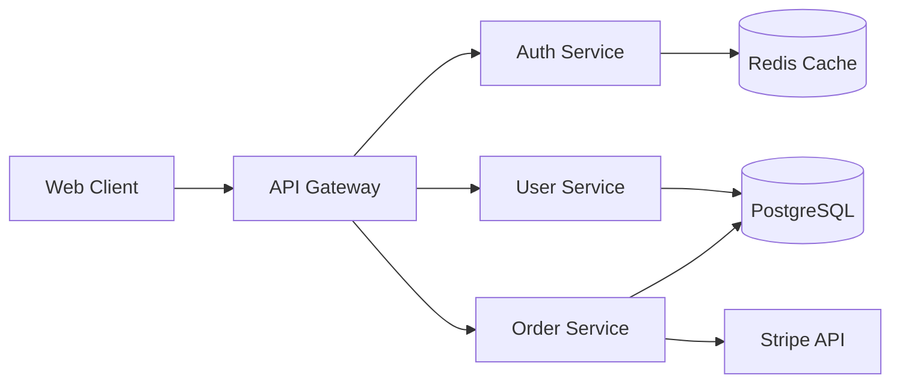

<objective>
Analyze existing codebase with parallel mapper agents.

Replaces: gsd:map-codebase, fullstack:intake:document-codebase, fullstack:intake:create-system-description

Spawns 4 parallel flow-mapper agents, each with a focus area:
- **tech**: STACK.md (technologies), INTEGRATIONS.md (external services)
- **arch**: ARCHITECTURE.md (patterns), STRUCTURE.md (directory layout)
- **quality**: CONVENTIONS.md (code style), TESTING.md (test patterns)
- **concerns**: CONCERNS.md (tech debt, risks, improvement areas)

If a specific focus area is provided, only spawn that agent.

Also creates SYSTEM.md (living system description) at deep/epic depth.
</objective>

<context>
$ARGUMENTS
</context>

<process>

## Step 1: Setup

1. Create `.flow/codebase/` directory if not exists
2. Determine focus: all 4 areas (default) or specific area from argument

## Step 2: Spawn Mapper Agents

Spawn **flow-mapper** agents in parallel (one per focus area):

Each agent:
- Explores the codebase within its focus
- Writes document directly to `.flow/codebase/{document}.md`
- Returns confirmation (not content — keeps orchestrator lean)

```
Parallel:
  Agent flow-mapper(focus=tech)    → STACK.md, INTEGRATIONS.md
  Agent flow-mapper(focus=arch)    → ARCHITECTURE.md, STRUCTURE.md
  Agent flow-mapper(focus=quality) → CONVENTIONS.md, TESTING.md
  Agent flow-mapper(focus=concerns)→ CONCERNS.md
```

## Step 3: System Description (deep/epic)

If project depth is deep or epic, create `.flow/SYSTEM.md`:
- SOC2-style system description
- Architecture overview, API surface, security patterns
- External dependencies
- Updated after each `/flow:complete`

## Step 3.5: Auto-Generate Mermaid Architecture Diagram

After mapper agents complete, generate a Mermaid diagram from their output:

1. Read `.flow/codebase/ARCHITECTURE.md` (produced by the arch mapper)
2. Read `.flow/codebase/INTEGRATIONS.md` (produced by the tech mapper)
3. Generate a `graph LR` Mermaid diagram that shows:
   - Key modules/layers (e.g., Client → API → Services → Database)
   - External integrations (e.g., → Stripe, → Redis, → S3)
   - Data flow direction
   - Keep it concise (max 15-20 nodes — readable at a glance)
4. Write to TWO locations:
   - `.flow/codebase/ARCHITECTURE.mmd` (ephemeral, lives with flow state)
   - `docs/diagrams/architecture.mmd` (persistent, survives `.flow/` cleanup)
   - Create `docs/diagrams/` directory if it doesn't exist
5. This runs EVERY time `/flow:map` is invoked, keeping the diagram fresh

Example output format:


## Step 4: Present Results

```
Codebase mapped:
  .flow/codebase/STACK.md              — Technologies and versions
  .flow/codebase/INTEGRATIONS.md       — External services
  .flow/codebase/ARCHITECTURE.md       — Design patterns
  .flow/codebase/ARCHITECTURE.mmd      — Mermaid architecture diagram (auto-generated)
  .flow/codebase/STRUCTURE.md          — Directory layout
  .flow/codebase/CONVENTIONS.md        — Code style and conventions
  .flow/codebase/TESTING.md            — Test patterns and coverage
  .flow/codebase/CONCERNS.md           — Tech debt and risks
  docs/diagrams/architecture.mmd       — Persistent architecture diagram

Ready to plan: /flow:plan or /flow:start
```

</process>
